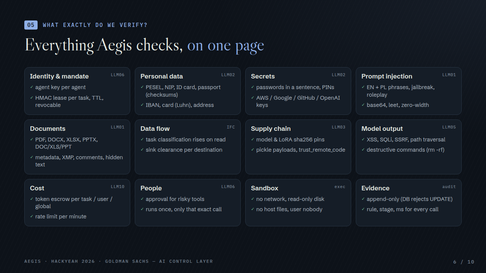
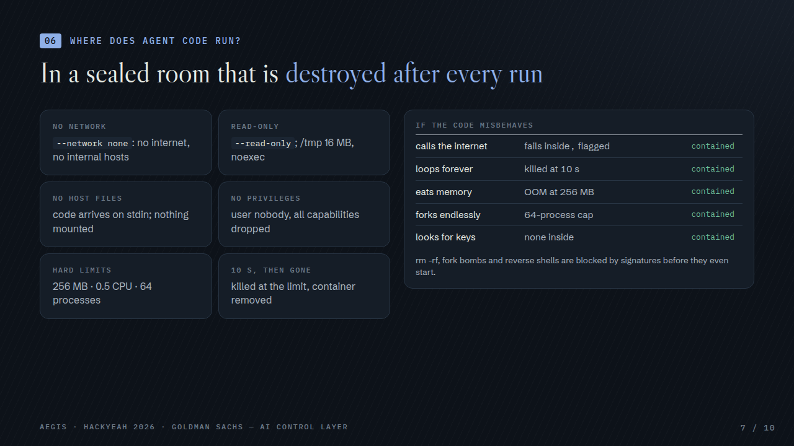

# 1 · Solution

## Overview

**Aegis is a control gateway that sits between AI agents and everything they can touch** — models, tools, files,
MCP servers and other agents. Other guardrails ask whether an action *looks* dangerous. Aegis first asks whether
the agent was **authorized** to do it — for this task, with this data, within this budget — and only then
whether the content is malicious.

- A trusted app opens a **task**. Aegis issues a short-lived, HMAC-signed **lease** bound to a **mandate**:
  which tools, files and recipients are allowed, which models, how many tokens, for how long.
- The agent sends every call (chat, tool, MCP, delegation) with that lease. Each call passes **10 checks,
  cheapest first**; the first BLOCK ends it. Decisions are `ALLOW`, `REDACT` (content masked, call continues) or
  `BLOCK` (nothing runs), each with a rule id, stage and timing, written to an append-only audit.
- **Rules decide permissions; AI can only tighten.** A local model scores manipulation as a second line, but a
  deterministic rule can never be overridden by it.
- The agent **never holds credentials**: tools accept only the gateway's secret (a direct call gets 401), and
  agent code runs in a sealed, network-less sandbox.
- Everything runs **on-prem on one GB10** (model via vLLM), with fixed, countable cost.

Live: landing <https://aegis.alfaguys.com> · dashboard <https://dashboardaegis.alfaguys.com> ·
API <https://gatewayaegis.alfaguys.com> ([docs](https://aegis.alfaguys.com/docs/)) · pitch deck
[`docs/pitch/aegis.pdf`](../docs/pitch/aegis.pdf) · 60 s film [`docs/pitch/aegis-film.mp4`](../docs/pitch/aegis-film.mp4).



## Implemented controls / guardrails

| # | Control | What it enforces | Rule ids | Default |
|---|---|---|---|---|
| 1 | **Rate limit + circuit breaker** | requests/min per agent, user and globally; a task blocked 10× in 60 s is cut off | `RATE-001`, `CIRCUIT-001` | on |
| 2 | **Task mandate** | tool, resource (file path) and recipient allow-lists; lease validity, expiry, revocation; delegation only as a subset, depth ≤ 3 | `MANDATE-TOOL`, `MANDATE-RES`, `MANDATE-RCPT`, `MANDATE-MODEL`, `TOOL-UNKNOWN` | on |
| 3 | **Model allow-list & artifact pins** | only listed models; weights / LoRA adapters must match a pinned sha256 | `MODEL-001`, `MODEL-HASH-001/002` | on |
| 4 | **Attack signatures** (external feed) | 13 signatures: pickle payloads, `trust_remote_code`, CVE-2024-34359, reverse shells / download-and-execute, `rm -rf`, XSS, SQLi, SSRF, path traversal, typosquatted model hosts, MCP tool poisoning | `ATK-*` | block |
| 5 | **Personal data (PII)** | PESEL, NIP, ID card, passport (checksums), IBAN, card (Luhn), address, e-mail, phone, GPS in image metadata | `PII-001`, `PII-002` | redact |
| 6 | **Secrets** | passwords written in a sentence, PINs, AWS / Google / GitHub / OpenAI keys, JWTs, connection strings, private keys | `SEC-001` | block |
| 7 | **Prompt injection** | EN + PL phrases, jailbreak / roleplay, markdown exfiltration, de-obfuscation (NFKC, zero-width, leet, spaced letters, base64), multi-turn reassembly | `INJ-001`, `INJ-002` | profile |
| 8 | **Documents** | PDF, DOCX, XLSX, PPTX, legacy DOC/XLS/PPT, images, scans (OCR pol+eng): hidden text, metadata, XMP, comments, hidden sheets, speaker notes; active content (JavaScript, macros, DDE, remote templates) | `DOC-001` (+ PII/SEC/INJ per hidden part) | block |
| 9 | **Data flow (information-flow control)** | a task's classification rises with what it reads; data may only go to destinations cleared for it (incl. cloud vs on-prem models) | `IFC-001` | on |
| 10 | **Human approval** | risky tools (`http.post`) wait for a person; only that exact call runs, once, within a TTL | `APPROVAL-001` | on |
| 11 | **AI review (semantic)** | local model (or heuristic fallback) scores manipulation; can only tighten; fails closed | `SEM-001/002` | on |
| 12 | **Budget escrow** | tokens/calls/concurrency reserved atomically in Postgres **before** the call, settled after; per task, user, global; guard's own budget | `BUD-001/002`, `BUD-GUARD` | on |
| 13 | **Sandbox for code** | `code.run` only in a throw-away container: no network, read-only root, no mounts, user nobody, caps dropped, 256 MB / 0.5 CPU / 64 pids / 10 s | `SBX-001` | profile |
| 14 | **Output check (DLP)** | model answers and tool results are scanned before the agent sees them | `PII-*`, `SEC-*`, `INJ-*`, `ATK-*` | on |
| 15 | **MCP proxy** | `tools/list` filtered by the mandate; tool definitions pinned by hash, changed ones quarantined | `ATK-MCP-POISON-001` | on |
| 16 | **Audit** | append-only (the DB refuses UPDATE/DELETE); rule, stage, timings, never raw content; JSONL/CSV export | — | on |

Mapping to OWASP LLM Top 10: LLM01 injection (5–8, 11) · LLM02 disclosure (5, 6, 9, 14) · LLM03 supply chain
(3, 4, 15) · LLM05 output handling (4, 13, 14) · LLM06 excessive agency (2, 10) · LLM10 unbounded consumption (1, 12).



## Configuration

Everything is in **one file**, [`policy/policy.yaml`](../policy/policy.yaml); attack signatures live in a separate
feed, [`feeds/attacks.yaml`](../feeds/attacks.yaml). Both are **hot-reloaded within 1 s** (dashboard, admin API or
editing the file). An invalid file is rejected and the last good version keeps running; every version is stored and
can be rolled back in one click.

```yaml
profile: balanced                    # strict | balanced | permissive (defaults for every control)
controls:
  mandate: {enabled: true}
  ifc_taint: {enabled: true}
  model_allowlist: {enabled: true}
  pii: {enabled: true, mode: redact, entities: [PESEL, NIP, ID_CARD, PASSPORT, IBAN, CREDIT_CARD, ...]}
  secrets: {enabled: true, mode: block}
  attack_signatures: {enabled: true, mode: block}
  injection_heuristics: {enabled: true}          # mode from profile (strict = block)
  semantic: {enabled: true, backend: auto, on_error: block}   # AI review, fail-closed
  documents: {enabled: true, mode: block}
  code_execution: {}                              # block | sandbox | allow (from profile)
budgets:
  per_principal: {tokens: 200000, calls: 2000, concurrency: 20}
  global: {tokens: 2000000, calls: 20000, concurrency: 100}
  max_delegation_depth: 3
  rate_limits: {per_agent_per_minute: 60, per_principal_per_minute: 120, global_per_minute: 1000}
  circuit_breaker: {enabled: true, blocks: 10, window_seconds: 60}
approvals: {tools: [http.post], ttl_seconds: 900}
models:
  allow: [mock/echo, "main/*"]
  pinned: {legal-lora/adapter_model.safetensors: "sha256:f8d5…"}
sinks: {mail.send:external: PUBLIC, llm:onprem: CONFIDENTIAL, llm:external: PUBLIC, ...}
task_profiles:
  contract_review: {tools: [...], resources: ["/clients/{client}/*"], recipients_allow: [...], budget: {...}, ttl_seconds: 900}
```

Policies that can be enforced:

- **Who may do what**: per task profile — tools, file paths (templated by task params, e.g. `/clients/{client}/*`),
  e-mail recipients, models, budget, TTL; delegation depth.
- **What data may go where**: classification per resource, clearance per sink (tool, recipient domain, model
  location), so "confidential to a cloud model" or "client data to an outside address" is blocked.
- **Content**: per control on/off, `redact` vs `block`, PII entity list, AI-review threshold, profile presets.
- **Cost**: tokens / calls / concurrency per task, user and globally; rate limits; circuit breaker.
- **People**: which tools need approval and for how long it is valid.
- **Supply chain**: model allow-list, pinned hashes, `require_pinned`, signature feed (local file or URL).

From the dashboard (**Configure → Controls / Policy file / Attack signatures / Tools**) or the admin API
(`PUT /admin/policy`, `PUT /admin/policy/profile`, `POST /admin/policy/rollback/{seq}`, …).
