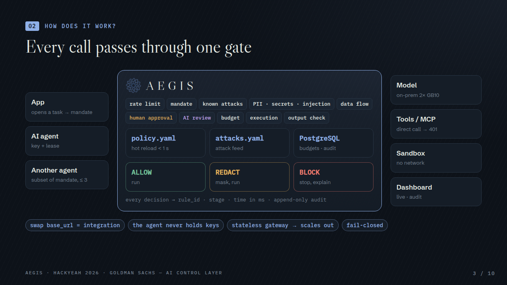
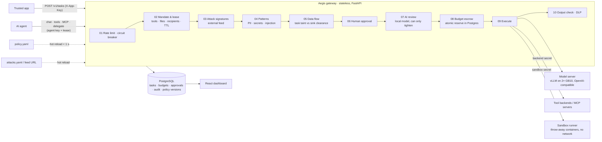
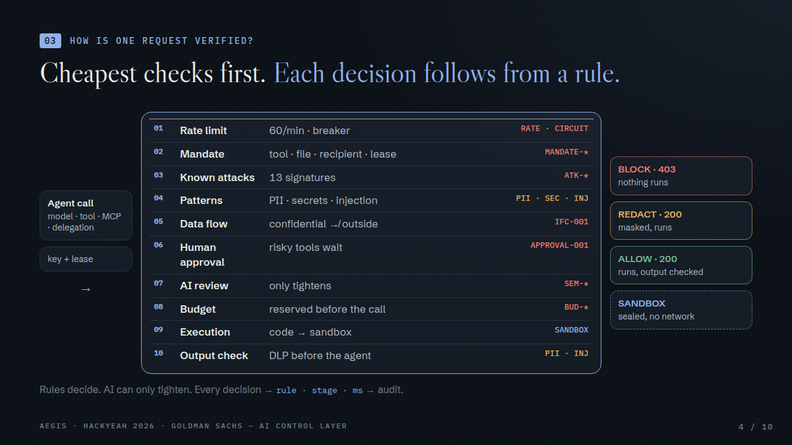
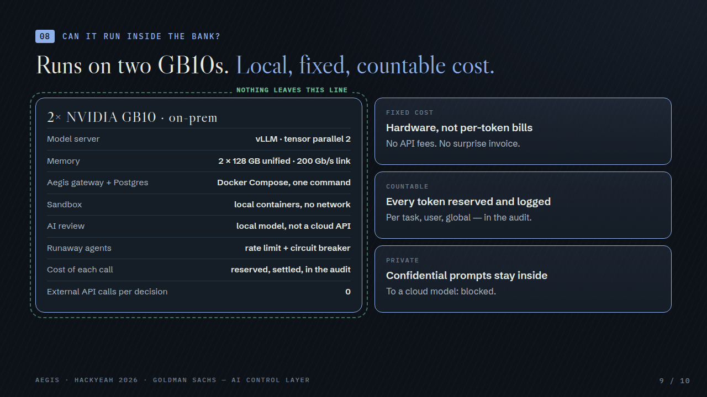

# 2 · Architecture

## Diagram

How one request is verified — each row is a rule that can stop it, cheapest first:

Components ([`5-implementation`](../5-implementation/) has the code map):

| Component | Role |
|---|---|
| Gateway (`aegis/app.py`, `aegis/engine.py`) | OpenAI-compatible `/v1/chat/completions`, `/v1/tools/{tool}/call`, `/mcp`, task API; runs the pipeline; stateless, so it scales horizontally |
| PostgreSQL | tasks and leases, budgets with atomic escrow, approvals, rate counters, append-only audit, policy versions |
| Tool backends / MCP (`aegis/backends.py`) | accept only the gateway's secret; keep call counters as evidence that a blocked call never arrived |
| Sandbox runner (`aegis/sandbox.py`) | the only service with Docker access; starts a locked-down container per `code.run` |
| Model server | any OpenAI-compatible endpoint; production: vLLM on the team's two GB10s (on-prem, tensor parallel 2) |
| Dashboard (`dashboard/`) | live decisions, audit, approvals, budgets, configuration, scenario replay |

**Design choices**

- **Fail-closed**: model / tool / sandbox down → 502 refusal, never "allow on error"; AI review errors block.
- **Deterministic first**: permissions and data flow are decided by rules; the model-based review can only make a
  decision stricter, so a model mistake can't open a hole (shown by the "AI detector misses" scenario).
- **Escrow, not check-then-spend**: tokens are reserved before the model call; 30 concurrent agents can't overspend.
- **Credentials never reach the agent**: the gateway holds tool secrets; direct calls get 401.

## Performance

Measured with `make bench` (`python -m aegis.bench`): the real pipeline in-process, real PostgreSQL, real tool
backends; mock model with a fixed 50 ms generation delay; heuristic AI-review backend. 4-vCPU cloud container
(Intel Xeon 2.10 GHz), 150 measured requests per workload. Full report: [`docs/bench-report.md`](../docs/bench-report.md).

### Deterministic enforcement

| What | p50 | p95 | p99 |
|---|---:|---:|---:|
| Content checks only (signatures, PII, secrets, injection) | **0.36 ms** | 0.55 ms | 0.67 ms |
| Blocked tool call, full decision (mandate, checks, data flow, audit write) | **2.33 ms** | 3.55 ms | 3.93 ms |
| Allowed tool call end to end (incl. Postgres escrow and the tool) | **7.05 ms** | 9.81 ms | 13.4 ms |
| Chat, gateway overhead (end to end minus the 50 ms mock model) | ~9 ms | ~12 ms | |

Per stage (p50, 900 decisions): mandate 0.20 ms · signatures 0.09 ms · patterns 0.20 ms · data flow 0.02 ms ·
budget escrow (Postgres) 3.16 ms · output signatures 0.10 ms · output patterns 0.06 ms.

Throughput (mixed workload): 32 req/s at concurrency 1 · 102 req/s at 4 · **195 req/s at 16** (one container).

### Non-deterministic enforcement (AI review)

| Backend | Added latency | Notes |
|---|---:|---|
| Heuristic scorer (default without a model server) | 0.02 ms p50 | deterministic fallback, always available |
| Local model on the GB10s (`semantic.backend: auto`) | the model's own latency | one short classification per untrusted input; identical concurrent inputs share one call; timeout → fail-closed |

The AI review runs **after** all deterministic checks, so anything a rule blocks never costs a model call, and it
only runs on untrusted content (user input, tool results, files). Its token use is reserved from a separate guard
budget (`BUD-GUARD`), so the guard can't starve the agents.

### Against other guardrails

| | Latency per check | Source |
|---|---:|---|
| **Aegis** content checks · full blocked decision | **0.36 ms · 2.3 ms** | measured (above) |
| Protect AI classifier v2 (GPU) | 18 ms | arXiv 2502.15427 |
| Lakera Guard (API, 1k chars) | < 20 ms | vendor docs |
| LLM Guard | 30–200 ms | Protect AI |
| Azure Prompt Shields | 100–300 ms | TrueFoundry docs |
| NeMo Guardrails · Llama Guard 3 8B | ~500 ms | arXiv 2502.15427 · Cloudflare docs |

Methods differ; the other figures are published by their authors. Details and links: [`docs/benchmarks.md`](../docs/benchmarks.md).
