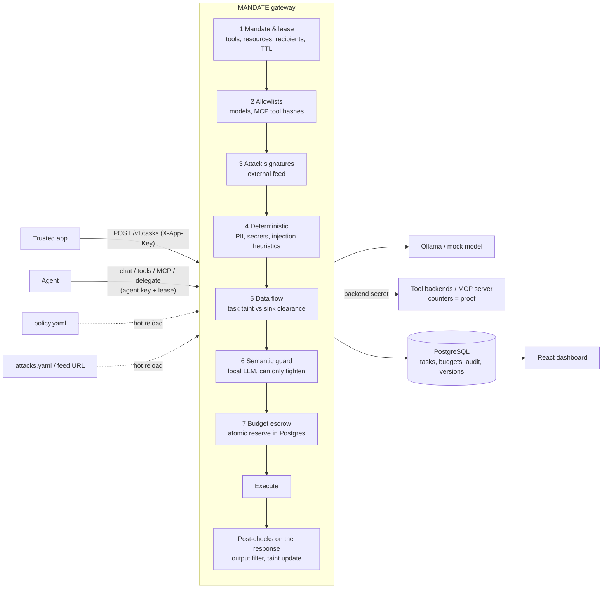

# MANDATE — AI Control Layer

**Zero-trust execution contracts for AI agents.** HackYeah 2026 · Goldman Sachs challenge.

> Other guardrails ask whether an action *looks* dangerous. MANDATE asks whether this agent was ever
> **authorized** to do it, with this data, for this task.

MANDATE is a gateway that sits between agents and everything they touch: models, tools, MCP servers
and other agents. Every task gets a short-lived **mandate**: which resources it may read, which tools it may call,
where results may go, how much it may spend and for how long. Every call is checked against the mandate, the
central policy and the data the task has already seen. Only then does it run.

## Quick start

Requirements: Docker Desktop. No API keys and no paid services. Everything runs locally.

```bash
cp .env.example .env
make run                 # postgres + gateway + mock tool backends
open http://localhost:8000/dashboard/
```

Optional: install [Ollama](https://ollama.com) on the host and run `ollama pull qwen2.5:3b`. The semantic guard
then uses the local model. Without Ollama it falls back to a local heuristic scorer, and the dashboard says so.

| Command | What it does |
|---|---|
| `make run` / `make down` | start / stop the stack |
| `make test-docker` | run the full test suite inside the image (81 tests) |
| `make venv && make test` | same suite on the host |
| `make demo` | run every scripted scenario against the running stack |
| `make clean` | drop containers **and** the database volume |

Default keys live in `.env.example`: admin `dev-admin-key`, app `dev-app-key`, agent `agent-key-demo`.

## Architecture



* **Single source of truth:** `policy/policy.yaml`. The dashboard and the admin API rewrite this file. Each write is
  validated, saved as a new version in `policy_versions`, written atomically and hot-reloaded. Hand edits are picked
  up within about 1 s (file watcher plus sha256 polling). An invalid policy is rejected and the last-known-good
  version stays active.
* **Fail-closed:** an unreachable semantic guard, an unknown tool or a missing catalog label leads to a block or to
  the strictest treatment.
* **Credentials stay in the gateway:** tool backends require a secret that only the gateway holds. A direct call
  returns `401`.
* **Scalability:** budget atomicity lives in Postgres (`UPDATE … WHERE spent+reserved+n <= limit` across all scopes
  in one transaction). The gateway is therefore stateless apart from its policy snapshot, and every instance polls
  the same file.

## What makes it different

| Feature | What it means | Where |
|---|---|---|
| **Task mandate + lease** | Capabilities scoped to one task. The HMAC lease is bound to the agent and the principal. It dies on completion, revocation or TTL expiry. | `mandate/tasks.py` |
| **Data lineage (taint)** | Reading a `CONFIDENTIAL` document makes the whole task `CONFIDENTIAL`. Paraphrasing, translating or encoding does not lower it. Sinks have a clearance (`mail.send:external` = `PUBLIC`). Labels come from a trusted catalog, never from the model. | `engine.py taint_check` |
| **Proof of enforcement** | Each decision records `tool_invoked`. Backend counters show that a blocked mail never arrived (`mail_sent` stays 0). | `backends.py`, dashboard |
| **Budget escrow** | Reserve before execute, across task → parent → principal → global. Tested with 30 concurrent agents: overspend is 0. | `mandate/budget.py` |
| **Hybrid defence** | Deterministic rules decide authority. The semantic model can only tighten a decision. The `detector_miss` scenario forces the AI detector to say "safe", and the data-flow rule still blocks. | `semantic.py` |

## Controls and OWASP mapping

| Control | Type | Default | OWASP |
|---|---|---|---|
| `mandate`: tools, resources, recipients, TTL | deterministic | block | LLM06 Excessive Agency, Agentic: privilege compromise |
| `ifc_taint`: data flow by classification | deterministic | block | LLM02 Sensitive Information Disclosure |
| `model_allowlist` | deterministic | block | LLM03 Supply Chain |
| `pii`: PESEL (checksum), card (Luhn), IBAN (mod-97), e-mail, phone | deterministic | redact (strict: block) | LLM02 |
| `secrets`: cloud keys, private keys, tokens, password assignments | deterministic | block | LLM02 |
| `injection_heuristics`: override phrases, hidden markup, concealment | deterministic | redact (strict: block) | LLM01 Prompt Injection |
| `semantic`: local LLM risk score (thresholds per profile) | AI | block ≥ 0.7, flag ≥ 0.5 | LLM01, Agentic: goal manipulation |
| `attack_signatures`: external feed | deterministic | block | LLM03, LLM05 |
| Budget escrow (tokens, calls, concurrency, guard budget) | deterministic | block (429) | LLM10 Unbounded Consumption |
| MCP tool hash pinning and quarantine | deterministic | block | LLM01 / Invariant Labs tool poisoning |
| Case-scoped memory | deterministic | block | Agentic: memory poisoning |

**Historical attacks** (`feeds/attacks.yaml`, editable live or served from `ATTACK_FEED_URL`):
- unsafe deserialization: a pickle opcode scan that never unpickles, plus `pickle.loads`, `torch.load` without
  `weights_only` and unsafe `yaml.load` in generated code;
- `trust_remote_code=True`;
- CVE-2024-34359 (llama-cpp-python < 0.2.72, SSTI in the GGUF `chat_template`);
- code-execution primitives sent to code tools;
- download-and-execute and reverse-shell commands;
- model sources from non-allowlisted or typosquatted hosts;
- MCP tool definitions changed after approval.

Supply-chain checks run before a component is used: `POST /v1/models/register`.

## Policy, profiles and severity

```yaml
profile: balanced        # strict | balanced | permissive: defaults for `controls`
controls:
  pii: {enabled: true}   # explicit fields win over the profile
profiles:
  strict:   {semantic: {block_at_risk: 0.4}, pii: {mode: block}, injection_heuristics: {mode: block}}
  balanced: {semantic: {block_at_risk: 0.7}, pii: {mode: redact}}
```

`block_at_risk` is the semantic risk at which a request is blocked. A lower value is stricter; adherence =
`1 - block_at_risk`. Severity is set per control with `mode: block | redact`. Budgets are configured per principal,
globally, for the guard itself and as `default_max_tokens`, which keeps every reservation bounded. Task profiles
(`task_profiles`) are mandate templates. See the comments in [`policy/policy.yaml`](policy/policy.yaml).

## Guide for the jury

1. **Dashboard → Demo scenarios.** Each button runs a scripted agent through the real gateway:
   `injection` (exfiltration attempt, mail counter stays 0), `detector_miss`, `cross_client`, `expired_lease`,
   `mcp_poison`, `supply_chain`, `budget_race`.
2. **Playground.** Type any text, choose where it comes from, its destination and the task classification. You get
   the decision, the rule, the evidence and the redacted text. Nothing is executed.
3. **Controls.** Switch the profile, toggle a control, change block/redact, move the semantic threshold. The next
   request uses the new policy version.
4. **Policy & versions.** Edit the YAML, then save or break it on purpose. You get a 422, the active version is
   unchanged and the attempt appears in the history. Roll back with one click; a rollback is appended as a new
   version.
5. **Attack feed.** Add a regex signature, test it and see it block in the Playground right away.
6. **Edit the file directly:** `policy/policy.yaml` or `feeds/attacks.yaml` on disk. The change is picked up within
   about 1 s.
7. **Try to bypass:** `curl -X POST localhost:8001/tools/mail.send -d '{"args":{}}' -H 'Content-Type: application/json'`
   returns `401`.
8. **Audit log:** filter, expand the evidence, export JSONL or CSV. The database rejects `UPDATE` and `DELETE` on
   `audit_events`.

### Using the gateway from an agent

```bash
# app creates a task (mandate) for a user
curl -s localhost:8000/v1/tasks -H 'X-App-Key: dev-app-key' -H 'Content-Type: application/json' \
  -d '{"principal":"lawyer_anna","agent_id":"demo-agent","profile":"contract_review","params":{"client":"A"}}'
# -> {"task_id": "...", "lease": "...", "mandate": {...}}

H='-H "Authorization: Bearer agent-key-demo" -H "X-Mandate-Lease: <lease>"'
POST /v1/chat/completions            # OpenAI-compatible, model "ollama/qwen2.5:3b" or "mock/echo"
POST /v1/tools/{tool}/call           # {"args": {...}}
POST /mcp                            # JSON-RPC: initialize, tools/list (filtered), tools/call
POST /v1/tasks/{id}/delegate         # child mandate ⊆ parent, inherits taint, charged to parent budget
POST /v1/tasks/{id}/complete         # lease dies
```

Each response carries a `mandate` object: `action`, `reason_code`, `rule_id`, `policy_version`, `latency_ms`,
`tool_invoked`, `findings`, `timings`. Blocked requests return `403`, budget denials `429`.

Admin API (`X-Admin-Key`, see `/docs`): policy, controls, profile, models, sinks, task-profiles, budgets,
signatures (CRUD and test), tasks (list, detail, revoke), documents (labels), tools (approve, quarantine),
reservations, memory, audit and export, stats, metrics, SSE events, playground, simulation, scenarios.

## Tests

`make test-docker` runs 81 tests against a real Postgres (`goldman_test`), the real gateway and the real tool
backends.

* `tests/cases/content.yaml`: expected decisions for content controls, written independently of the code and
  run through the Playground API.
* Positive and negative cases for every control: mandate, impersonation and forged leases, lifecycle, taint, PII,
  output filter, injection in documents, signatures, live feed edits, MCP quarantine, delegation escalation,
  memory isolation, budget (over-limit, concurrency, runaway loop, uncertain reservations), hot reload,
  last-known-good, rollback, admin auth (401/403/422), append-only audit, exports without raw content, every demo
  scenario.
* The semantic guard runs on the deterministic local scorer in CI; live-model tests are marked `-m live`.

## Performance telemetry

`GET /admin/metrics` and the dashboard report p50, p95 and p99 per stage (`mandate`, `deterministic`,
`signatures`, `data_flow`, `semantic`, `budget`, `execute`, `model_call`) and for the full decision. Simulator
traffic is tagged `synthetic` and excluded from these figures by default. Figures depend on hardware and model;
report them together with the machine and the model.

## Known limits (deliberate)

* Taint is **conservative**: after a confidential read, the whole task is confidential. This can block harmless
  output (false positive). Per-sentence provenance is future work.
* Streaming responses are buffered and checked before release.
* The heuristic semantic scorer is a fallback, not a replacement for the model; we report which backend is active.
* Not built in this MVP: multi-instance policy push (`LISTEN/NOTIFY`), automated tests for the secret detectors.
  Redis is the path for very high request rates.

## Repo map

```
mandate/      gateway (app, engine pipeline, policy, attacks, detectors, semantic, budget, tasks, audit, admin)
mandate/backends.py   mock tool backends + MCP server with counters
dashboard/    React + Vite dashboard, Polish/English (built into the image, served at /dashboard)
policy/       central policy (single source of truth)
feeds/        attack signature feed
db/init/      Postgres schema + seed (trusted document catalog)
demo/data/    synthetic contracts (one with a hidden injection)
tests/        pytest suite
```
