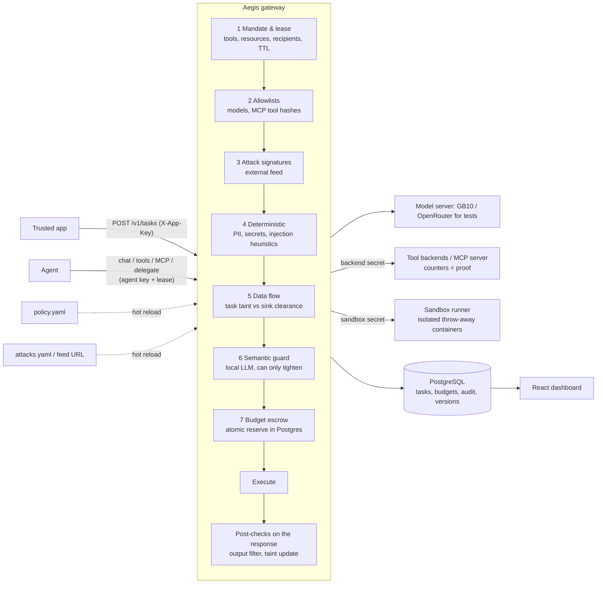

# Aegis — AI Control Layer

**Zero-trust execution contracts for AI agents.** HackYeah 2026 · Goldman Sachs challenge.

> Other guardrails ask whether an action *looks* dangerous. Aegis asks whether this agent was ever
> **authorized** to do it, with this data, for this task.

Aegis is a gateway that sits between agents and everything they touch: models, tools, MCP servers
and other agents. Every task gets a short-lived **mandate**: which resources it may read, which tools it may call,
where results may go, how much it may spend and for how long. Every call is checked against the mandate, the
central policy and the data the task has already seen. Only then does it run.

The whole thing is a FastAPI gateway plus a mock tool/MCP backend and a PostgreSQL database, with a React
dashboard and a static landing page. It runs with one command.

## Quick start

Requirements: Docker Desktop. Everything except the model runs locally in Docker.

```bash
cp .env.example .env     # put the model server key into LLM_API_KEY
make run                 # postgres + gateway + tool backends
open http://localhost:8000/dashboard/
```

`make run` copies `.env.example` to `.env` for you if `.env` is missing. The dashboard asks for the admin key on
first use; the default is `dev-admin-key` (see `.env.example`).

**Model server.** The agent console and the AI review use one OpenAI-compatible model server, configured in `.env`:

| Variable | Testing (now) | Production (team's GB10) |
|---|---|---|
| `LLM_BASE_URL` | `https://openrouter.ai/api/v1` | `http://<gb10-host>:8000/v1` (vLLM / SGLang / llama.cpp) |
| `LLM_API_KEY` | OpenRouter key | server key, or empty |
| `LLM_MODEL` | `deepseek/deepseek-v4.1-flash` | the id the GB10 serves |
| `LLM_LOCATION` | `onprem` (behaves as production) | `onprem` |
| `LLM_EXTRA_BODY` | `{"reasoning": {"enabled": false}}` | server-specific, or empty |

Switching to the GB10 means changing these values and nothing else. `LLM_LOCATION` tells the data-flow rule where the
server lives: `onprem` may receive confidential data, `cloud` only public data. While testing through OpenRouter,
prompts really leave the machine, so use only the synthetic demo documents. Without a configured server the AI review falls back to a local heuristic scorer and the console uses the
`mock/echo` test model.

| Command | What it does |
|---|---|
| `make run` / `make down` | start / stop the stack |
| `make logs` / `make ps` | follow the gateway log / show containers |
| `make test-docker` | run the full test suite inside the image |
| `make venv && make test` | same suite on the host |
| `make bench` | performance telemetry report → `docs/bench-report.md` (p50/p95/p99 per stage, throughput) |
| `make demo` | run every scripted scenario against the running stack |
| `make redteam` | start the stack and replay the adversarial corpus (OWASP LLM / agentic techniques, 17 probes incl. negative controls) |
| `make dashboard-dev` | Vite dev server for the dashboard |
| `make landing` | build and start the landing page as its own nginx container on :8080 |
| `make db-shell` | open `psql` in the database container |
| `make clean` | drop containers **and** the database volume |

Default keys live in `.env.example`: admin `dev-admin-key`, app `dev-app-key`, agent `agent-key-demo` /
`agent-key-other`, plus the HMAC lease secret and the tool-backend secret.

## Architecture



* **Single source of truth:** `policy/policy.yaml`. The dashboard and the admin API rewrite this file. Each write is
  validated, saved as a new version in `policy_versions`, written atomically (tmp + `fsync` + `os.replace`, keeping
  comments via ruamel) and hot-reloaded. Hand edits are picked up within about 1 s (file watcher plus sha256
  polling). An invalid policy is rejected and the last-known-good version stays active.
* **Fail-closed:** an unreachable semantic guard, an unknown tool or a missing catalog label leads to a block or to
  the strictest treatment. The semantic model can only tighten a decision, never grant one.
* **Credentials stay in the gateway:** tool backends require a secret that only the gateway holds. A direct call
  returns `401`.
* **Scalability:** budget atomicity lives in Postgres (`UPDATE budgets SET reserved = reserved + n WHERE
  spent + reserved + n <= token_limit` across all scopes in one transaction). The gateway is therefore stateless
  apart from its policy snapshot, and every instance polls the same file.

## How a request is checked

Each channel enters the gateway at a different point but converges on the same pipeline. Order is cheap-to-expensive
and the first `BLOCK` short-circuits, so the semantic model never runs for a request already blocked deterministically.

**Agent → model** (`POST /v1/chat/completions`)
1. Authenticate the agent key and verify the HMAC lease (task, agent, expiry, status).
2. **Mandate + allowlist:** the model must be allowed by the policy *and* by the task mandate; the model's sink is
   taint-checked.
3. **Content checks** on every non-assistant message: attack signatures, secrets, PII, injection heuristics.
4. **Semantic guard** on the collected untrusted text (user messages and tool results).
5. **Budget escrow:** reserve `prompt_tokens + max_tokens` across task → parent(s) → principal → global.
6. **Execute** the model call, then settle the reservation with actual usage.
7. **Output filter:** the answer is scanned (signatures, secrets, PII) before release; a `REDACT` is applied, a `BLOCK`
   withholds it.

**Agent → tool** (`POST /v1/tools/{tool}/call`, and MCP `tools/call`)
1. Mandate: tool allow-list, resource pattern, recipient, and MCP quarantine status.
2. Outbound arguments are content-checked (PII applies only when the sink's clearance is below `CONFIDENTIAL`).
3. Data-flow: writing to a sink below the task's classification is blocked (`IFC-001`).
4. Budget reserve (calls + concurrency) → execute against the backend with the backend secret → settle.
5. Post-checks: a read raises the task's taint from the document's trusted label; the tool result is scanned and can
   be redacted or withheld.

A decision carries `action`, `reason_code`, `rule_id`, `stage`, `policy_version`, `latency_ms`, `tool_invoked`,
`task_id`, `findings` and per-stage `timings`. Chat completions also return `sanitized`: the messages the guard
changed (redacted PII, cut-out instructions) exactly as the model received them. Blocked requests return `403`,
budget denials `429`, an unavailable model/tool `502`, and auth failures `401`.

## What makes it different

| Feature | What it means | Where |
|---|---|---|
| **Task mandate + lease** | Capabilities scoped to one task. The HMAC lease is bound to the agent and the principal. It dies on completion, revocation or TTL expiry. | `aegis/tasks.py` |
| **Data lineage (taint)** | Reading a `CONFIDENTIAL` document makes the whole task `CONFIDENTIAL`. Paraphrasing, translating or encoding does not lower it. Sinks have a clearance (`mail.send:external` = `PUBLIC`). Labels come from a trusted catalog, never from the model. | `engine.py taint_check` |
| **Proof of enforcement** | Each decision records `tool_invoked`. Backend counters show that a blocked mail never arrived (`mail_sent` stays 0). | `backends.py`, dashboard |
| **Budget escrow** | Reserve before execute, across task → parent → principal → global. Tested with 30 concurrent agents: overspend is 0. | `aegis/budget.py` |
| **Hybrid defence** | Deterministic rules decide authority. The semantic model can only tighten a decision. The `detector_miss` scenario forces the AI detector to say "safe", and the data-flow rule still blocks. | `semantic.py` |

## Controls and OWASP mapping

| Control | Type | Default | OWASP |
|---|---|---|---|
| `mandate`: tools, resources, recipients, TTL | deterministic | block | LLM06 Excessive Agency, Agentic: privilege compromise |
| `ifc_taint`: data flow by classification | deterministic | block | LLM02 Sensitive Information Disclosure |
| `model_allowlist` | deterministic | block | LLM03 Supply Chain |
| `pii`: PESEL (checksum), NIP (mod-11), ID card and passport (check digit), address, card (Luhn), IBAN (mod-97), e-mail, phone | deterministic | redact (strict: block) | LLM02 |
| `secrets`: cloud keys, private keys, tokens, database URLs with credentials, passwords and PINs written in a sentence ("moje hasło to …") | deterministic | block | LLM02 |
| `injection_heuristics`: override phrases (EN/PL), jailbreak and role-play, markdown-image exfiltration, hidden markup, concealment; also after de-obfuscation (zero-width, homoglyphs, leetspeak, spaced letters, base64) | deterministic | redact (strict: block) | LLM01 Prompt Injection |
| `semantic`: LLM risk score on the main model server (thresholds per profile) | AI | block ≥ 0.7, flag ≥ 0.5 | LLM01, Agentic: goal manipulation |
| `attack_signatures`: external feed | deterministic | block | LLM03, LLM05 |
| Budget escrow (tokens, calls, concurrency, guard budget) | deterministic | block (429) | LLM10 Unbounded Consumption |
| Sandboxed code execution (`code.run`) | deterministic | sandbox (strict: block) | LLM05 Improper Output Handling, CWE-94 |
| MCP tool hash pinning and quarantine | deterministic | block | LLM01 / Invariant Labs tool poisoning |
| Case-scoped memory | deterministic | block | Agentic: memory poisoning |
| `approvals`: calls a person must approve first (default: `http.post`); only the exact approved call runs, once | deterministic + human | hold (403 `APPROVAL_REQUIRED`) | LLM06 Excessive Agency, Agentic: human-in-the-loop |
| `max_delegation_depth`: agent → agent hand-offs per task chain (default 3); every hop keeps a subset mandate and the parent's taint | deterministic | block | Agentic: confused deputy, runaway recursion |
| Multi-turn injection: an instruction split across messages is checked on the joined conversation (`INJ-002`) | deterministic | block | LLM01 |
| Output and tool-call validation: XSS in generated HTML, SQL injection, SSRF to internal/metadata addresses, credential files (`ATK-XSS/SQLI/SSRF/FILE`) | deterministic | block | LLM05 Improper Output Handling, CWE-79/89/918 |
| `documents`: files read by agents or uploaded (PDF, DOCX/XLSX/PPTX, legacy DOC/XLS/PPT, JPEG/PNG/TIFF/WebP). Metadata, XMP (XML), annotations, form fields, comments, hidden runs, hidden sheets and slides, speaker notes, formulas, EXIF and PNG text chunks are checked like the text and reported by location; a GPS position in a photo is personal data (`PII-002`); scripts, auto-actions, launch actions, embedded files, macros, DDE formulas and remote templates are active content (`DOC-001`) | deterministic | block | LLM01 indirect injection, LLM05 |

**Historical attacks** (`feeds/attacks.yaml`, editable live or served from `ATTACK_FEED_URL`):
- unsafe deserialization: a pickle opcode scan (`pickletools.genops`, the file is never unpickled) that flags
  dangerous globals, plus `pickle.loads`, `marshal.loads`, `torch.load` without `weights_only=True`,
  unsafe `yaml.load` and `joblib.load` in generated code;
- `trust_remote_code=True`;
- CVE-2024-34359 (llama-cpp-python < 0.2.72, SSTI in the GGUF `chat_template`);
- code-execution primitives sent to code tools;
- download-and-execute and reverse-shell commands;
- model sources from non-allowlisted or typosquatted hosts (Levenshtein distance);
- MCP tool definitions changed after approval.

Supply-chain checks run before a component is used, through `POST /v1/models/register`: the payload may carry a
`source_url`, `packages` versions, `gguf_metadata.tokenizer.chat_template` and base64 `files` (pickles are scanned by
opcode, never loaded).

## Policy, profiles and severity

```yaml
profile: balanced        # strict | balanced | permissive: defaults for `controls`
controls:
  pii: {enabled: true}   # explicit fields win over the profile
profiles:
  strict:   {semantic: {block_at_risk: 0.4}, pii: {mode: block}, injection_heuristics: {mode: block}}
  balanced: {semantic: {block_at_risk: 0.7}, pii: {mode: redact}}
```

`block_at_risk` is the semantic risk at which a request is blocked. A lower value is stricter; adherence =
`1 - block_at_risk`. Severity is set per control with `mode: block | redact`. Budgets are configured per principal,
globally, for the guard itself and as `default_max_tokens`, which keeps every reservation bounded. Task profiles
(`task_profiles`) are mandate templates: resources, tools, recipients, sink narrowings, model list, budget and TTL.
The policy also defines which sink each model provider counts as (`providers`) and which mail domains count as
internal (`internal_domains`). See the comments in [`policy/policy.yaml`](policy/policy.yaml).

## Using the gateway from an agent

```bash
# app creates a task (mandate) for a user
curl -s localhost:8000/v1/tasks -H 'X-App-Key: dev-app-key' -H 'Content-Type: application/json' \
  -d '{"principal":"lawyer_anna","agent_id":"demo-agent","profile":"contract_review","params":{"client":"A"}}'
# -> {"task_id": "...", "lease": "...", "mandate": {...}}

POST /v1/chat/completions            # OpenAI-compatible, model "main/<LLM_MODEL>" or "mock/echo"
POST /v1/tools/{tool}/call           # {"args": {...}}
POST /mcp                            # JSON-RPC: initialize, tools/list (filtered), tools/call
POST /v1/tasks/{id}/delegate         # child mandate ⊆ parent, inherits taint, charged to parent budget
POST /v1/tasks/{id}/complete         # lease dies
POST /v1/models/register             # supply-chain check before a model/component is used
```

Agent requests carry `Authorization: Bearer <agent-key>` and `X-Mandate-Lease: <lease>`. The principal comes from
the authenticated app key, never from the body. A child task cannot exceed its parent's tools, resources or budget,
and budget usage is charged to every ancestor.

Each response carries a `mandate` object as described above. Admin API endpoints are under `/admin` and require
`X-Admin-Key` (see `/docs` for the OpenAPI schema).

## Dashboard

The React + Vite dashboard is built into the gateway image and served at `/dashboard` (English / Polish, switchable).
It has three groups:

* **Watch** — `Live` (SSE decision stream, tool counters, spend, latency per stage, top rules), `Tasks` (mandates,
  taint, budgets, revoke), `Audit log` (filter and export).
* **Configure** — `Controls` (profile, per-control toggles and block/redact, semantic thresholds), `Policy file`
  (YAML editor, validate, save as a new version, history with rollback), `Attack signatures` (CRUD and test a regex),
  `Tools` (MCP registry status, approve/quarantine).
* **Prove** — `Live test` (a normal chat with the assistant, like any chat app; the panel on the right is the
  guard layer live: per-stage timings, what was redacted before the model saw it, tokens and cost), `Be the agent`
  (drive a real task through the real pipeline from the browser), `Run a scenario`
  (scripted end-to-end demos), `Test an input` (playground dry-run: decision, rule, evidence, redacted text, nothing
  executed), `Budget` (limits, reservations, spend).

### Guide for the jury

The console opens on **Start here**: six guided steps with clickable example prompts, a live on/off demo of a
control, and a tip panel on every page with what to try next. The steps below are the same, in long form.

1. **Run a scenario.** Each button drives a scripted agent through the real gateway, database and tool service:
   `clean` (all ALLOW), `injection` (exfiltration attempt, mail counter stays 0), `detector_miss`,
   `cross_client`, `expired_lease`, `mcp_poison`, `supply_chain`, `budget_race`.
2. **Test an input.** Type any text, choose where it comes from, its destination and the task classification. You get
   the decision, the rule, the evidence and the redacted text. Nothing is executed.
3. **Switch the profile / toggle a control.** Change block↔redact or move the semantic threshold. The next request
   uses the new policy version.
4. **Edit the policy.** Save a valid change, then break it on purpose. You get a `422`, the active version is
   unchanged and the attempt appears in the history. Roll back with one click; a rollback is appended as a new
   version.
5. **Add an attack signature.** Write a regex, test it on a sample, and see it block in the playground right away.
6. **Edit `policy/policy.yaml` or `feeds/attacks.yaml` on disk.** The change is picked up within about 1 s.
7. **Try to bypass.** `curl -X POST localhost:8001/tools/mail.send -H 'Content-Type: application/json' -d '{"args":{}}'`
   returns `401` — the backend secret is known only to the gateway.
8. **Force a detector miss.** `POST /admin/demo/semantic-override {"mode":"force_safe"}` makes the semantic guard say
   "safe"; the deterministic data-flow rule still blocks.
9. **Audit log.** Filter, expand the evidence, export JSONL or CSV. The database rejects `UPDATE` and `DELETE` on
   `audit_events`.

## API surface

**Public gateway** (`mandate/app.py`): `/health`, `POST /v1/tasks`, `GET /v1/tasks/{id}`,
`POST /v1/tasks/{id}/complete`, `POST /v1/tasks/{id}/delegate`, `POST /v1/chat/completions`,
`POST /v1/tools/{tool}/call`, `POST /mcp`, `POST /v1/models/register`.

**Admin** (`mandate/admin.py`, all behind `X-Admin-Key`): policy (`GET`/`PUT`, validate, reload, versions, rollback),
controls (`GET`, `PATCH`), profile, models (CRUD + available), sinks (CRUD), task-profiles (CRUD), budgets,
signatures (CRUD + test), tasks (list, detail, revoke), documents (labels), tools (approve, quarantine),
reservations (list, settle), budgets, memory (list, delete), audit (query, export JSONL/CSV), stats, metrics,
SSE events, playground, simulation, scenarios, agent console and backend demo helpers.

## Python SDK

`sdk/` is a small client package (`pip install ./sdk`) that depends only on `httpx`. It has sync and async
clients, typed decisions and one exception per refusal (`Rejected`, `Blocked`, `BudgetExceeded`,
`Unavailable`). Details: [`sdk/README.md`](sdk/README.md).

```python
from aegis_sdk import Aegis, Blocked
aegis = Aegis("http://localhost:8000", app_key="dev-app-key", agent_key="agent-key-demo")
with aegis.create_task(principal="lawyer_anna", agent_id="demo-agent",
                       profile="contract_review", params={"client": "A"}) as task:
    doc = task.call("doc.read", path="/clients/A/contracts/acquisition.txt")
    answer = task.chat(f"List the risks:\n{doc.content}")
```

## Tests

`make test-docker` runs the full suite against a real Postgres (`goldman_test`), the real gateway and the real tool
backends: **334 collected — all green in the Docker image** (on a bare host without tesseract the two OCR tests
skip; the image ships tesseract, so the canonical `make test-docker` run passes end to end).

* `tests/cases/redteam.yaml` + `make redteam`: a **17-probe adversarial corpus** (direct/translated/
  obfuscated/indirect prompt injection, markdown-image exfiltration, credential dump, IFC violation,
  RCE and reverse-shell payloads, unsafe deserialization, XSS in output, trust_remote_code) with
  negative controls proving the channel-scoped signatures do not overreach — replayed through the
  live stack by `make redteam` and pinned in-process by `tests/test_redteam_cases.py`.

* `tests/cases/content.yaml`: **100 expected decisions** for content controls, written independently of the
  code and run through the Playground API — PII checksum validators (PESEL, NIP, ID card, passport, Luhn,
  IBAN), **every secret type** (cloud keys, private keys, JWT, GitHub/Slack tokens, API keys, connection
  strings, passwords in plain words), injection (EN/PL, base64, leetspeak, zero-width), attack signatures,
  data flow, XSS/SQLi/SSRF — each with look-alikes that must pass.
* `tests/test_detectors.py`: unit tests pinning every detector regex (positive + negative per type).
* `tests/test_degradation.py`: **the jury drill, automated** — every one of the 10 controls is disabled in
  turn; the matrix proves the disable takes effect, the remaining controls still enforce, the change is
  audited (`POLICY_CHANGED` + `disabled_controls`) and re-enabling restores the decision.
* `tests/test_fuzz.py`: property-based tests (hypothesis) — every checksum-valid identifier constructed from
  first principles is detected and every corrupted one is not; injection probes survive arbitrary
  zero-width/leetspeak rewriting; the detectors never crash on arbitrary input.
* Positive and negative cases for every control: mandate, impersonation and forged leases, lifecycle, delegation
  escalation, taint, memory isolation, MCP listing/call/quarantine, output filter, budget (over-limit, concurrency,
  runaway loop, uncertain reservations, **cross-instance-safe lock ordering in the escrow**), model allowlist and
  provider data flow, hot reload, last-known-good, rollback, admin auth (401/403/422), append-only audit,
  exports without raw content, the agent console and every demo scenario.
* The semantic guard runs on the deterministic local scorer in CI; the model server is not required. Tests are
  async and use an in-process ASGI transport for both the gateway and the tool backends.

## Performance telemetry

`make bench` produces `docs/bench-report.md` on demand: p50/p95/p99 per pipeline stage, end-to-end
decision latency per workload and throughput at several concurrency levels, together with the machine
description and methodology (real pipeline, `mock/echo` model, heuristic semantic backend). At runtime
`GET /admin/metrics`, `GET /admin/stats` and the dashboard report p50, p95 and p99 per stage (`mandate`,
`signatures`, `deterministic`, `data_flow`, `semantic`, `budget`, `execute`, `model_call`) and for the
full decision. Simulator traffic is tagged `synthetic` and excluded from these figures by default. The
guard has its own budget, so the cost of protection itself is visible.

## Known limits (deliberate)

* Taint is **conservative**: after a confidential read, the whole task is confidential. This can block harmless
  output (false positive). Per-sentence provenance is future work.
* Streaming responses are buffered and checked before release.
* `code.run` executes in a throw-away container (no network, read-only, memory/CPU/pids caps, hard timeout). The
  sandbox runner is the only service with Docker access. A container shares the host kernel, so production would
  use gVisor or Firecracker; we state this openly.
* The heuristic semantic scorer is a fallback, not a replacement for the model; we report which backend is active.
* Not built in this MVP: multi-instance policy push (`LISTEN/NOTIFY`), per-sentence provenance.
  Redis is the path for very high request rates.

## Landing page

`landing/` is a static Astro site with its own `Dockerfile` (Node builds it, nginx serves it), so it can be hosted
separately from the gateway:

```bash
make landing                                   # local: http://localhost:8080
docker build -t aegis-landing \
  --build-arg PUBLIC_DASHBOARD_URL=https://<your-host>/dashboard/ landing
docker run -p 8080:80 aegis-landing          # anywhere
```

The "Open the dashboard" links are set at **container start** from `DASHBOARD_URL`, so one image works on any domain
without rebuilding. `PUBLIC_DASHBOARD_URL` (build arg) is only the fallback; `LANDING_BASE` sets a sub-path.

## Deploying on Coolify

Use **Build Pack: Docker Compose** with the compose file `docker-compose.coolify.yml`.

1. Set the domains per service in Coolify. A service can have several domains, comma-separated:
   - `gateway`: e.g. `https://app.example.com:8000` (`:8000` is the container port, not part of the public URL). It
     serves the dashboard at `/dashboard`, the API and MCP.
   - `landing`: e.g. `https://example.com,https://www.example.com`.
2. In **Environment Variables**, set `LLM_API_KEY`, plus `LLM_BASE_URL`, `LLM_MODEL` and `LLM_LOCATION` when you
   switch to the GB10. Set `DASHBOARD_URL` only if the landing page should link somewhere other than the gateway's
   generated URL.
3. Deploy. Coolify generates the database password, the admin, app and lease keys and the tool-backend secret
   (`SERVICE_PASSWORD_*`). Give the admin key (`SERVICE_PASSWORD_ADMIN`) to whoever opens the dashboard, e.g. the
   jury. It goes into "Admin key" in the top bar.

On Coolify, no ports are published and the Coolify proxy routes traffic. The gateway applies the database schema on
every start (idempotent). The policy and the attack feed live in volumes, seeded from the image on first start by
`docker/entrypoint.sh`, so console edits survive redeploys. The dev keys from `.env.example` are never used there.

**"Bind for 0.0.0.0:8000 failed: port is already allocated"**: Coolify's own panel listens on port 8000 of the
server. No compose file in this repo publishes host ports any more (local ports live in
`docker-compose.override.yml`, which Coolify does not load), so redeploy after pulling. Still pointing Coolify at
`docker-compose.yml` works, but `docker-compose.coolify.yml` is the one that wires the generated domains and secrets.

## Repo map

```
aegis/       gateway (app, engine pipeline, policy, attacks, detectors, semantic, budget, tasks, audit, admin)
aegis/backends.py    mock tool backends + MCP server with counters
dashboard/    React + Vite dashboard, Polish/English (built into the image, served at /dashboard)
policy/       central policy (single source of truth)
feeds/        attack signature feed
db/init/      Postgres schema + seed (trusted document catalog)
demo/data/    synthetic contracts (one with a hidden injection)
tests/        pytest suite
```
